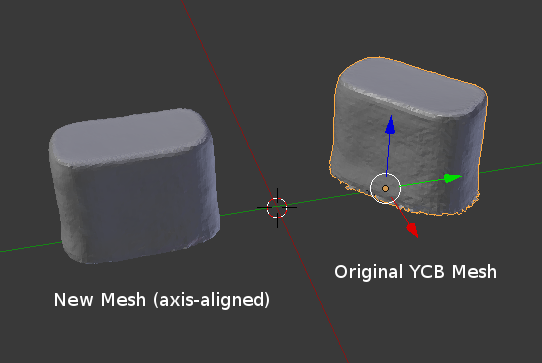
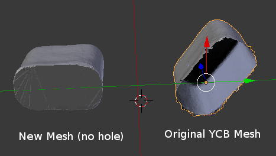

# ycb_solids
Solid axis-aligned mesh models for some household objects from the YCB dataset. PLY and STL files are included. See the images below for differences between the original YCB meshes and those included in this repository.

